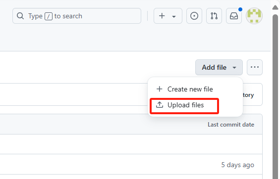
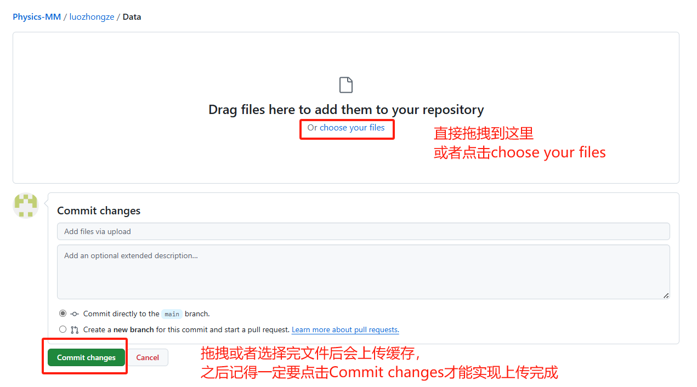

  
:kissing_closed_eyes:  公告  :kissing_closed_eyes:

  

``10.24：`` 可以直接使用 **simpletex** 对一整个包含文本和公式的区域进行识别（从而不再需要先用文字识别网站了），它会同时把文本和公式都识别下来，就像我这样截图就可以直接得到我们想要的文本和公式（点击复制文档或者手动选取复制即可），但是 **截图识别完之后也还需要再仔细查看一下字母和公式是否正确** 。

``10.23：`` **文件上传步骤如下** ，进入一个文件夹后 **右上角点击--Add file** ，比如下面就是在 **Data文件夹中添加文件** 。

``10.22：`` 我已经完成了我自己的 **2个doc文件** 的整理，大家可以进入 **luozhongze** 文件夹看我整理的txt，我的 **9.2.txt** 文件中 **index是从14开始的** ，也就是说我们每个doc整理完后的每个txt，题目的标签都是连续的，并且可以看到我 **Data文件夹中的图片也都是连续命名的** 。

还有就是，我们题目的解析中如果有图片， **不要把解析中的图片也另存为图片放进Data中** ，我们只需要保存题目中的图片。（就是直接跳过，txt里解析的文本怎么存就怎么存，当做没有这个图片，删去解析里 “如图x所示” 的类似内容）

***
文字识别网站: [https://catocr.com/#/](https://catocr.com/#/) **:flushed:  切记在文字识别后需要仔细查看一下字母的识别，容易缺漏  :flushed:**

截图转LaTex格式软件下载: [https://www.simpletex.cn/download](https://www.simpletex.cn/download)

我的讲解视频: [https://www.bilibili.com/video/BV138C1YAEbZ?vd_source=c20b3426f351777246b8b25c0f6890e8](https://www.bilibili.com/video/BV138C1YAEbZ?vd_source=c20b3426f351777246b8b25c0f6890e8)
***

我们每个人在这个仓库里都有自己名字命名的文件夹，文件夹有4个子文件夹。 :blush:  :blush:  :blush:

**Data** 里面放整理出来的选择题的图片，命名方法是：“题目序号_图片在这个题目中的序号（从0开始计数）”

**original** 我已经给大家整理好了，不需要改动（是每个人处理的doc原文件）

**selection** 里面需要放我们删去不需要内容后的doc文件（也就是需要整理的选择题）

**txts** 里面放每一个doc处理后的txt文件（命名如1.1.txt；1.2.txt；...）

这些文件点击后都可以直接下载，大家每天都可以看到每个人的进度，可以看我是怎么整理的。

每个人分配的专题doc文件是不等的，大家工作量不等，从 9 个doc到 21 个doc都有，大多数是 14 个左右。
***

从 ``10月19日`` 开始为第一个工作日，每人 ``2`` 天完成 ``1`` 个doc文件的整理，整理完 ``1`` 个txt **及时上传** ，并且还要上传``selection``和``Data``。

我会每天都看大家的完成情况（有事情忙可以提前先做很多，或者先跟我说明情况后再找时间补回来）。因为我们每个人工作量都不一样，先完成了的可以帮忙其他人完成。

我们所有人的所有任务的 DDL 是 ``1`` 个月，截止 ``11月20日`` 完成分配到的所有任务，**这需要先完成的同学及时帮助未完成的同学**。
